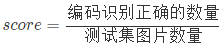

# Task01:赛题理解

## 一、赛题理解

### 1.1 赛题背景
本次新人赛是Datawhale与天池联合发起的零基础入门系列赛事第二场 —— 零基础入门CV赛事之街景字符识别。

赛题以计算机视觉中字符识别为背景，要求选手预测真实场景下的字符识别，这是一个典型的字符识别问题。通过这道赛题可以引导大家走入计算机视觉的世界，主要针对竞赛选手上手视觉赛题，提高对数据建模能力。

>链接：https://tianchi.aliyun.com/competition/entrance/531795/introduction

### 1.2 赛题数据
赛题来源自Google街景图像中的门牌号数据集（The Street View House Numbers Dataset, SVHN），并根据一定方式采样得到比赛数据集。

数据集报名后可见并可下载，该数据来自真实场景的门牌号。训练集数据包括3W张照片，验证集数据包括1W张照片，每张照片包括颜色图像和对应的编码类别和具体位置；为了保证比赛的公平性，测试集A包括4W张照片，测试集B包括4W张照片。


>样本展示

### 1.3 字段表

所有的数据（训练集、验证集和测试集）的标注使用JSON格式，并使用文件名进行索引。如果一个文件中包括多个字符，则使用列表将字段进行组合。

Field | Description
---|---
top	| 左上角坐标X
height | 字符高度
left | 左上角最表Y
width | 字符宽度
label | 字符编码
>注：数据集来源自SVHN，网页链接http://ufldl.stanford.edu/housenumbers/，并进行匿名处理和噪音处理，请各位选手使用比赛给定的数据集完成训练。

字符坐标如下：


在比赛数据（训练集和验证集）中，同一张图片中可能包括一个或者多个字符，因此在比赛数据的JSON标注中，会有两个字符的边框信息：

原始图片 | 图片json标注
:---: | :---:
 | 

### 1.4 评测标准
评价标准为准确率，选手提交结果与实际图片的编码进行对比，以编码整体识别准确率为评价指标，结果越大越好，具体计算公式如下：
<center>



</center>
​	

### 1.5 数据读取

```python
import json
train_json = json.load(open('../input/train.json'))

# 数据标注处理
def parse_json(d):
   arr = np.array([
       d['top'], d['height'], d['left'],  d['width'], d['label']
   ])
   arr = arr.astype(int)
   return arr

img = cv2.imread('../input/train/000000.png')
arr = parse_json(train_json['000000.png'])

plt.figure(figsize=(10, 10))
plt.subplot(1, arr.shape[1]+1, 1)
plt.imshow(img)
plt.xticks([]); plt.yticks([])

for idx in range(arr.shape[1]):
   plt.subplot(1, arr.shape[1]+1, idx+2)
   plt.imshow(img[arr[0, idx]:arr[0, idx]+arr[1, idx],arr[2, idx]:arr[2, idx]+arr[3, idx]])
   plt.title(arr[4, idx])
   plt.xticks([]); plt.yticks([])

```

## 1.6小结
这里是对于整个赛题的一个初步理解，由于对于视觉方面了解不深所以还需要通过本次学习去对于这个领域有一个全面的了解。

>参考：https://github.com/datawhalechina/team-learning/blob/master/03%20%E8%AE%A1%E7%AE%97%E6%9C%BA%E8%A7%86%E8%A7%89/%E8%AE%A1%E7%AE%97%E6%9C%BA%E8%A7%86%E8%A7%89%E5%AE%9E%E8%B7%B5%EF%BC%88%E8%A1%97%E6%99%AF%E5%AD%97%E7%AC%A6%E7%BC%96%E7%A0%81%E8%AF%86%E5%88%AB%EF%BC%89/Datawhale%20%E9%9B%B6%E5%9F%BA%E7%A1%80%E5%85%A5%E9%97%A8CV%20-%20Task%2001%20%E8%B5%9B%E9%A2%98%E7%90%86%E8%A7%A3%20.md
