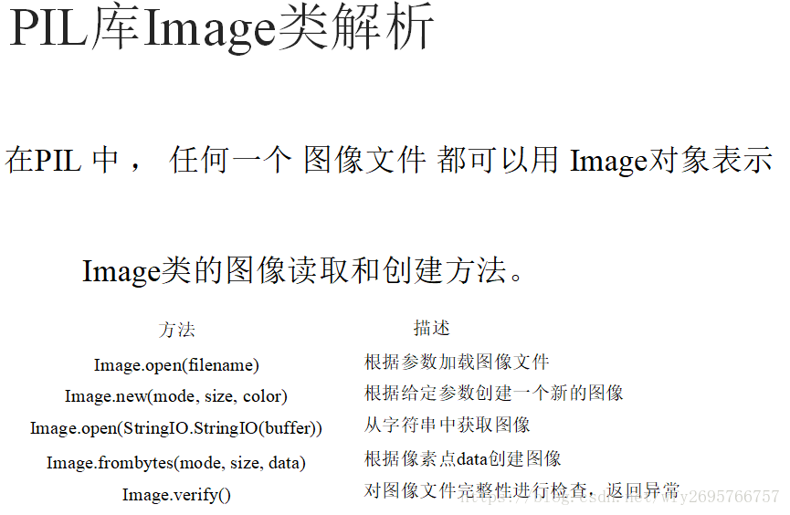
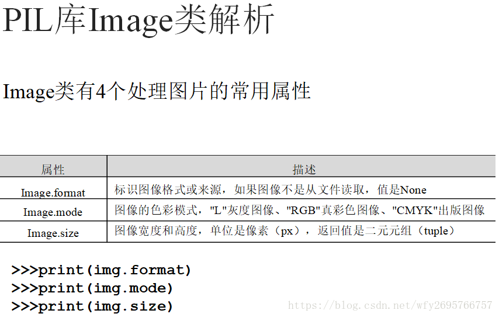
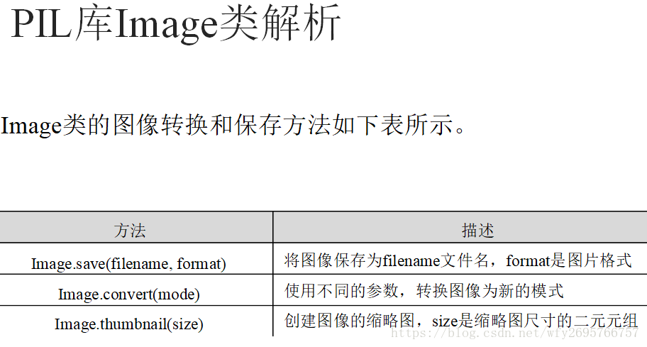
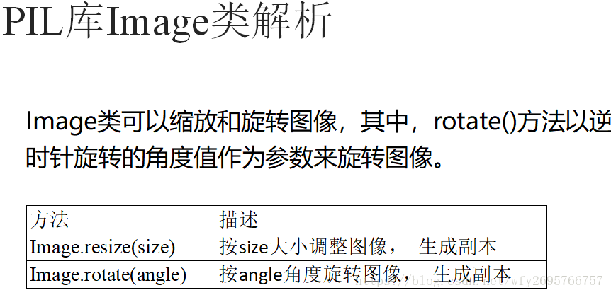
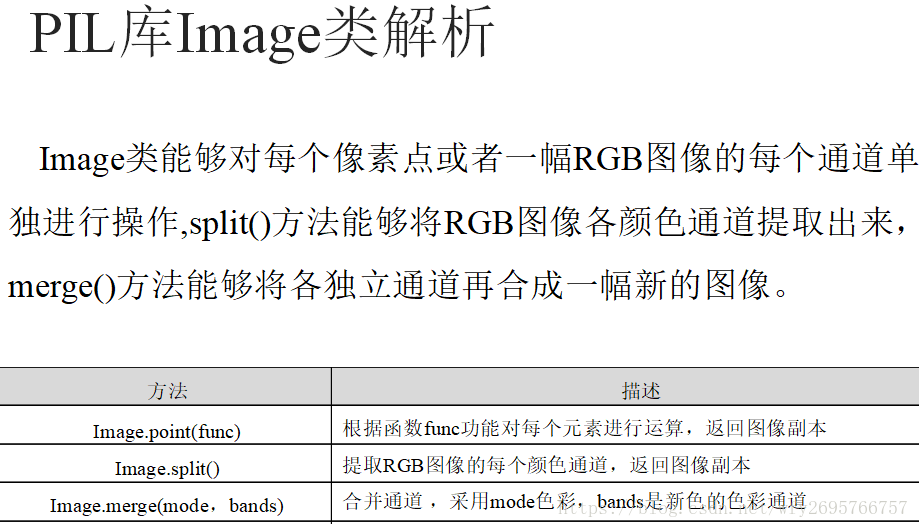
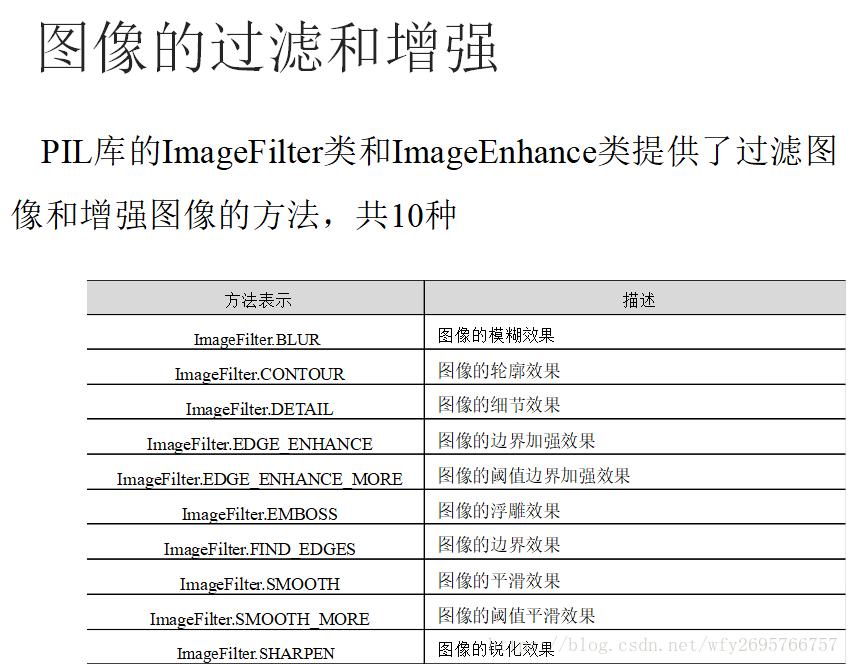
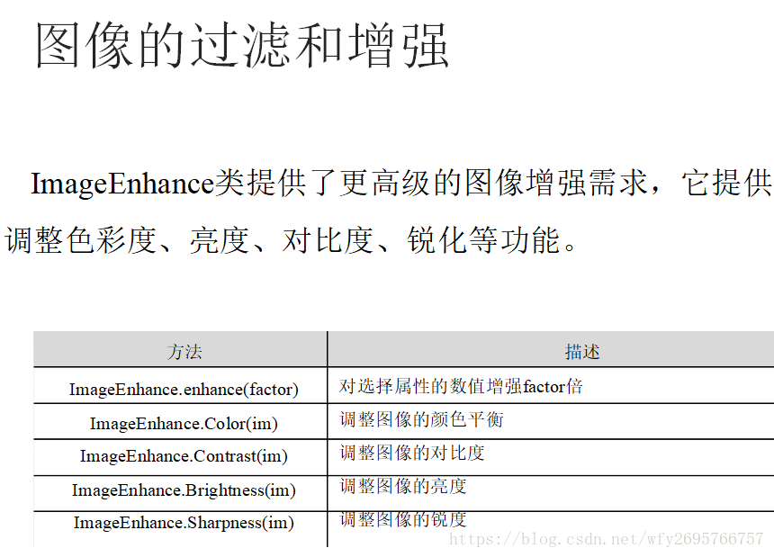

# Task02：数据读取与数据扩增

## 2.1 数据读取

结合本次赛题，本次赛题的数据为图像数据，赛题任务是识别所给图像中的字符。因此我们要完成对数据的读取操作，可以借助python中的库来完成数据的读取操作，比如OpenCV以及Pillow。

### 2.1.1 OpenCV

OpenCV 是计算机视觉中经典的专用库，其支持多语言、跨平台，功能强大。OpenCV-Python 为OpenCV提供了Python接口，使得使用者在Python中能够调用C/C++，在保证易读性和运行效率的前提下，实现所需的功能。

OpenCV-Python Tutorials 是官方提供的文档，其内容全面、简单易懂，使得初学者能够快速上手使用。2014年段力辉在当时已翻译过OpenCV3.0，但时隔五年，如今的 OpenCV4.1 中许多函数和内容已经有所更新，因此有必要对该官方文档再进行一次翻译。

Github地址：https://github.com/fendouai/OpenCVTutorials

对于英文不好的小伙伴可以参考中文官方文档：http://www.woshicver.com/

**主要方法**

**cv2.imread()**

    imread(img_path,flag) 读取图片，返回图片对象
        img_path: 图片的路径，即使路径错误也不会报错，但打印返回的图片对象为None
        flag：cv2.IMREAD_COLOR，读取彩色图片，图片透明性会被忽略，为默认参数，也可以传入1
            cv2.IMREAD_GRAYSCALE,按灰度模式读取图像，也可以传入0
            cv2.IMREAD_UNCHANGED,读取图像，包括其alpha通道，也可以传入-1
**cv2.imshow()**

    imshow(window_name,img)：显示图片，窗口自适应图片大小
        window_name: 指定窗口的名字
        img：显示的图片对象
        可以指定多个窗口名称，显示多个图片
        
    waitKey(millseconds)  键盘绑定事件，阻塞监听键盘按键，返回一个数字（不同按键对应的数字不同）
        millseconds: 传入时间毫秒数，在该时间内等待键盘事件；传入0时，会一直等待键盘事件
        
    destroyAllWindows(window_name) 
        window_name: 需要关闭的窗口名字，不传入时关闭所有窗口

**cv2.imwrite()**

    imwrite(img_path_name,img)
        img_path_name:保存的文件名
        img：文件对象

### 2.1.2 Pillow

python提供了python image library图像库，处理图像功能，该库提供了广泛的文件格式支持，如JPEG、PNG、GIF、等，它提供了图像档案、图像显示、图像处理等功能

PIL中所涉及到的基本概念包括，（bands)通道，（mode)模式，（coordinate system)坐标系统，（palette）调色板，（filters）过滤器

每张图像都是由一个或者多个数据通道构成，PIL可以在单张图片中合成相同维数和深度的多个通道，如RGB有三个通道，而灰度图像则只有一个通道

图像实际上是像素数据的矩形图，图像的模式定义了图像中像素的类型和深度，它在图像中定义mode模式的概念，如：

- 1:1位像素，表示黑和白，占8bit，在图像表示中称为位图
- L：表示黑白之间的灰度，占8bit像素
- p：8位像素，使用调色版映射
- RGB：为真彩色，占用3x8位像素，其中R为red红色，G为green绿色，B为blue蓝色，三原色叠加形成的色彩变化，如三通道都为0则代表黑色，都为255则代表白色
- RGBA：为带透明蒙版的真彩色，其中的A为alpha透明度，占用4x8位像素
  
其他的还有打印分色CMYK不是很常用不多做介绍

 PIL使用笛卡尔像素坐标系统，图像的坐标从左上角开始（0,0），坐标值表示像素的角，它实际上位于（0.5,0.5）；python中坐标通常以2元组(X,Y)的形式传递，矩形表示为4元组（l_x,t_y,r_x,b_y），X轴从左到右，Y轴从上到下，顺序是从左上右下表示，从左上角开始，如一个800X600像素的图像矩形表示为（0,0,800,600），它实际上时左上角锁定，向右下延伸的。

**以下是对于Pillow库Image类的相关介绍**

PIL库可以完成图像归档和图像处理两方面功能需求：

（1）图像归档：对图像进行批处理、生成图像预览、图像格式转换等；

（2）图像处理：图像基本处理、像素处理、颜色处理等。









## 2.2 数据增广

在赛题中我们需要对的图像进行字符识别，因此需要我们完成的数据的读取操作，同时也需要完成数据扩增（Data Augmentation）操作。

### 2.2.1 什么是数据增广？

数据增广是深度学习中常用的技巧之一，主要用于增加训练数据集，让数据集尽可能的多样化，使得训练的模型具有更强的泛化能力．现有的各大深度学习框架都已经自带了数据增广，但是平时在用的使用只是直接调用了对应的接口函数，而没有进行详细的分析．在实际应用中，并非所有的增广方式都适用当前的训练数据，你需要根据自己的数据集特征来确定应该使用哪几种数据增广方式．这篇文章的目的是为了更好地理解各种增广方式及其背后的真正原理．

目前数据增广主要包括：水平/垂直翻转，旋转，缩放，裁剪，剪切，平移，对比度，色彩抖动，噪声等，这里因为时间问题，有部分还每有完成，后续会进行更新。

所有的数据增广在操作的时候默认是以图像中心点进行的．从数学角度来看，任何操作都可以分成以下几个步骤：1). 首先将旋转点移动到原点处 ；2). 执行如2所描述的绕原点的旋转；3). 再将旋转点移回到原来的位置；这里为了更好地理解，给出一个示例：

### 2.2.2 数据增广方法

（1）镜像（Flip）

可以水平和垂直翻转（flip）图像。某些框架不提供垂直翻转功能。但是，垂直翻转相当于将图像旋转180度然后执行水平翻转。以下是翻转图像的示例。


（2）旋转（Rotation）

关于此操作需要注意的一件事是旋转后图像尺寸可能无法保留。如果您的图像是正方形，则以直角旋转它将保留图像大小。如果它是一个矩形，旋转180度将保持大小。以更精细（finer）的角度旋转图像也会改变最终的图像尺寸。我们将在下一节中看到我们如何处理这个问题。以下是以直角旋转的方形图像的示例。


（3）缩放（Scale）

图像可以向外缩放（放大）或者向内缩放（缩小）。如向外缩放（scaling outward）时，最终图像尺寸将大于原始图像尺寸，然后大多数图像框架从放大的新图像中剪切出一个部分，其大小等于原始图像。我们将在下一节中处理向内缩放，因为它会缩小图像大小，迫使我们对超出边界的内容做出假设。以下是放大的示例或图像。


（4）裁剪（Crop）

与缩放不同，我们只是从原始图像中随机抽样（sample）一个部分。然后，我们将此部分的大小调整为原始图像大小。这种方法通常称为随机裁剪（random cropping）。以下是随机裁剪的示例。仔细观察，您会发现此方法与缩放之间的区别。

注：数据增广中的缩放与裁剪区别在于crop和resize的顺序，缩放是先resize再crop，而裁剪时先crop再resize。顺序不同，对生成的图像影响很大，所以缩放和裁剪不能混为一谈。


（5）平移（Translation）

平移（translation）只涉及沿X或Y方向（或两者）移动图像。在下面的示例中，我们假设图像在其边界之外具有黑色背景，并且做适当的平移。这种增广方法非常有用，因为大多数对象几乎可以位于图像的任何位置。这迫使你的卷积神经网络可以无处不在的"look"。


（6）高斯噪声（Gaussian Noise）

当您的神经网络试图学习可能无用的高频特征（大量出现的图案）时，通常会发生过拟合（over-fitting）。具有零均值的高斯噪声基本上在所有频率中具有数据点（data points），从而有效地使高频特征失真（distorting）。这也意味着较低频率的元素（通常是您的预期数据）也会失真，但你的神经网络可以学会超越它。添加适量的噪声可以增强学习能力。

简单来说，给图像添加高斯噪声，会生成极为有用的图像，增加了有效样本，对训练网络有好处。

椒盐噪声（the salt and pepper noise）是一种常见的高斯噪声，它表现为随机的黑白像素在图像中传播。这类似于通过向图像添加高斯噪声而产生的效果，但可能具有较低的信息失真水平（lower information distortion level）。


以torchvision为例，常见的数据扩增方法包括：

- transforms.CenterCrop 对图片中心进行裁剪
- transforms.ColorJitter 对图像颜色的对比度、饱和度和零度进行变换
- transforms.FiveCrop 对图像四个角和中心进行裁剪得到五分图像
- transforms.Grayscale 对图像进行灰度变换
- transforms.Pad 使用固定值进行像素填充
- transforms.RandomAffine 随机仿射变换
- transforms.RandomCrop 随机区域裁剪
- transforms.RandomHorizontalFlip 随机水平翻转
- transforms.RandomRotation 随机旋转
- transforms.RandomVerticalFlip 随机垂直翻转

### 2.2.3 常用的数据扩增库
- torchvision
  
https://github.com/pytorch/vision
pytorch官方提供的数据扩增库，提供了基本的数据数据扩增方法，可以无缝与torch进行集成；但数据扩增方法种类较少，且速度中等；

- imgaug
  
https://github.com/aleju/imgaug
imgaug是常用的第三方数据扩增库，提供了多样的数据扩增方法，且组合起来非常方便，速度较快；

- albumentations

https://albumentations.readthedocs.io
是常用的第三方数据扩增库，提供了多样的数据扩增方法，对图像分类、语义分割、物体检测和关键点检测都支持，速度较快。

### 2.3 Pytorch读取数据

由于本次赛题我们使用Pytorch框架讲解具体的解决方案，接下来将是解决赛题的第一步使用Pytorch读取赛题数据。
在Pytorch中数据是通过Dataset进行封装，并通过DataLoder进行并行读取。所以我们只需要重载一下数据读取的逻辑就可以完成数据的读取。

```python
import os, sys, glob, shutil, json
import cv2

from PIL import Image
import numpy as np

import torch
from torch.utils.data.dataset import Dataset
import torchvision.transforms as transforms

class SVHNDataset(Dataset):
    def __init__(self, img_path, img_label, transform=None):
        self.img_path = img_path
        self.img_label = img_label 
        if transform is not None:
            self.transform = transform
        else:
            self.transform = None

    def __getitem__(self, index):
        img = Image.open(self.img_path[index]).convert('RGB')

        if self.transform is not None:
            img = self.transform(img)
        
        # 原始SVHN中类别10为数字0
        lbl = np.array(self.img_label[index], dtype=np.int)
        lbl = list(lbl)  + (5 - len(lbl)) * [10]
        
        return img, torch.from_numpy(np.array(lbl[:5]))

    def __len__(self):
        return len(self.img_path)

train_path = glob.glob('../input/train/*.png')
train_path.sort()
train_json = json.load(open('../input/train.json'))
train_label = [train_json[x]['label'] for x in train_json]

data = SVHNDataset(train_path, train_label,
          transforms.Compose([
              # 缩放到固定尺寸
              transforms.Resize((64, 128)),

              # 随机颜色变换
              transforms.ColorJitter(0.2, 0.2, 0.2),

              # 加入随机旋转
              transforms.RandomRotation(5),

              # 将图片转换为pytorch 的tesntor
              # transforms.ToTensor(),

              # 对图像像素进行归一化
              # transforms.Normalize([0.485,0.456,0.406],[0.229,0.224,0.225])
            ]))
```

接下来我们将在定义好的Dataset基础上构建DataLoder。

- Dataset：对数据集的封装，提供索引方式的对数据样本进行读取。
- DataLoder：对Dataset进行封装，提供批量读取的迭代读取。
  
加入DataLoder后，数据读取代码改为如下：
```python
import os, sys, glob, shutil, json
import cv2

from PIL import Image
import numpy as np

import torch
from torch.utils.data.dataset import Dataset
import torchvision.transforms as transforms

class SVHNDataset(Dataset):
    def __init__(self, img_path, img_label, transform=None):
        self.img_path = img_path
        self.img_label = img_label 
        if transform is not None:
            self.transform = transform
        else:
            self.transform = None

    def __getitem__(self, index):
        img = Image.open(self.img_path[index]).convert('RGB')

        if self.transform is not None:
            img = self.transform(img)
        
        # 原始SVHN中类别10为数字0
        lbl = np.array(self.img_label[index], dtype=np.int)
        lbl = list(lbl)  + (5 - len(lbl)) * [10]
        
        return img, torch.from_numpy(np.array(lbl[:5]))

    def __len__(self):
        return len(self.img_path)

train_path = glob.glob('../input/train/*.png')
train_path.sort()
train_json = json.load(open('../input/train.json'))
train_label = [train_json[x]['label'] for x in train_json]

train_loader = torch.utils.data.DataLoader(
        SVHNDataset(train_path, train_label,
                   transforms.Compose([
                       transforms.Resize((64, 128)),
                       transforms.ColorJitter(0.3, 0.3, 0.2),
                       transforms.RandomRotation(5),
                       transforms.ToTensor(),
                       transforms.Normalize([0.485, 0.456, 0.406], [0.229, 0.224, 0.225])
            ])), 
    batch_size=10, # 每批样本个数
    shuffle=False, # 是否打乱顺序
    num_workers=10, # 读取的线程个数
)

for data in train_loader:
    break
```
在加入DataLoder后，数据按照批次获取，每批次调用Dataset读取单个样本进行拼接。此时data的格式为：

    torch.Size([10, 3, 64, 128]), torch.Size([10, 6])

前者为图像文件，为batchsize * chanel * height * width次序；后者为字符标签。

## 2.4 小结

本章介绍了深度学习中视觉问题所需要的python库的使用方法和应用，也列举了图像增广的技术方法，最后使用pytorch框架对于本次赛题的数据进行读取处理。

## 本文参考

- (一)OpenCV-Python学习—基础知识 https://www.cnblogs.com/silence-cho/p/10926248.html
- python3之成像库pillow https://www.cnblogs.com/zhangxinqi/p/9286506.html
- Python的Pillow库进行图像文件处理(配图详解) https://blog.csdn.net/wfy2695766757/article/details/81193370
- 数据增广之详细理解 https://zhuanlan.zhihu.com/p/43665254
- 深度学习中的数据增广 https://blog.csdn.net/a8039974/article/details/82791717
- 深度学习图像数据增广方法总结 https://www.jianshu.com/p/e653ffa9de66
- Datawhale 零基础入门CV赛事-Task2 数据读取与数据扩增 https://github.com/datawhalechina/team-learning/blob/master/03%20%E8%AE%A1%E7%AE%97%E6%9C%BA%E8%A7%86%E8%A7%89/%E8%AE%A1%E7%AE%97%E6%9C%BA%E8%A7%86%E8%A7%89%E5%AE%9E%E8%B7%B5%EF%BC%88%E8%A1%97%E6%99%AF%E5%AD%97%E7%AC%A6%E7%BC%96%E7%A0%81%E8%AF%86%E5%88%AB%EF%BC%89/Datawhale%20%E9%9B%B6%E5%9F%BA%E7%A1%80%E5%85%A5%E9%97%A8CV%20-%20Task%2002%20%E6%95%B0%E6%8D%AE%E8%AF%BB%E5%8F%96%E4%B8%8E%E6%95%B0%E6%8D%AE%E6%89%A9%E5%A2%9E.md