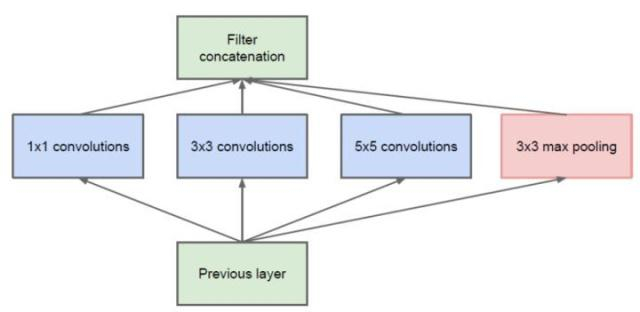

# Task3 字符识别模型

## 三、字符识别模型

### 3.1 本章任务

- 学习卷积神经网络（CNN）的基础知识以及原理。
- 应用pytorch框架构建CNN模型，进行训练。

### 3.2 卷积神经网络（CNN）

#### 发展背景和基本概念
卷积神经网络（Convolutional Neural Network，CNN）是一种前馈型的神经网络，其在大型图像处理方面有出色的表现，目前已经被大范围使用到图像分类、定位等领域中。相比于其他神经网络结构，卷积神经网络需要的参数相对较少，使的其能够广泛应用。

卷积神经网络是目前深度学习技术领域中非常具有代表性的神经网络之一，在图像分析和处理领域取得了众多突破性的进展，在学术界常用的标准图像标注集ImageNet上，基于卷积神经网络取得了很多成就，包括图像特征提取分类、场景识别等。卷积神经网络相较于传统的图像处理算法的优点之一在于避免了对图像复杂的前期预处理过程，尤其是人工参与图像预处理过程，卷积神经网络可以直接输入原始图像进行一系列工作，至今己经广泛应用于各类图像相关的应用中。

从卷积神经网络的提出到目前的广泛应用，大致经历了理论萌芽阶段、实验发展阶段以及大规模应用和深入研究阶段。

（1） 理论萌芽阶段。1962年Hubel以及Wiesel通过生物学研究表明，从视网膜传递脑中的视觉信息是通过多层次的感受野（Receptive Field）激发完成的，并首先提出了感受野的概念。1980年日本学者Fukushima在基于感受野的概念基础之上，提出了神经认知机(Neocognitron)。神经认知机是一个自组织的多层神经网络模型，每一层的响应都由上一层的局部感受野激发得到，对于模式的识别不受位置、较小形状变化以及尺度大小的影响。神经认知机可以理解为卷积神经网络的第一版，核心点在于将视觉系统模型化，并且不受视觉中的位置和大小等影响。 

（2）实验发展阶段。1998年计算机科学家Yann LeCun等提出的LeNet5采用了基于梯度的反向传播算法对网络进行有监督的训练，Yann LeCun在机器学习、计算机视觉等都有杰出贡献，被誉为卷积神经网络之父。LeNet5网络通过交替连接的卷积层和下采样层，将原始图像逐渐转换为一系列的特征图，并且将这些特征传递给全连接的神经网络，以根据图像的特征对图像进行分类。感受野是卷积神经网络的核心，卷积神经网络的卷积核则是感受野概念的结构表现。学术界对于卷积神经网络的关注，也正是开始于LeNet5网络的提出，并成功应用于手写体识别。同时，卷积神经网络在语音识别、物体检测、人脸识别等应用领域的研究也逐渐开展起来。

（3）大规模应用和深入研究阶段。在LeNet5网络之后，卷积神经网络一直处于实验发展阶段。直到2012年AlexNet网络的提出才奠定了卷积神经网络在深度学习应用中的地位，Krizhevsky（他是hintion的学生对应的论文就是刚开始提到的深度卷积神经网络）等提出的卷积神经网络AlexNet在ImageNet的训练集上取得了图像分类的冠军，使得卷积神经网络成为计算机视觉中的重点研究对象，并且不断深入。在AlexNet之后，不断有新的卷积神经网络提出，包括牛津大学的VGG网络、微软的ResNet网络、谷歌的GoogLeNet网络等，这些网络的提出使得卷积神经网络逐步开始走向商业化应用，几乎只要是存在图像的地方，就会有卷积神经网络的身影。

从目前的发展趋势而言，卷积神经网络将依然会持续发展，并且会产生适合各类应用场景的卷积神经网络，例如，面向视频理解的3D卷积神经网络等。值得说明的是，卷积神经网络不仅仅应用于图像相关的网络，还包括与图像相似的网络，例如，在围棋中分析棋盘等。


- **LeNet-5模型**

在CNN的应用中，文字识别系统所用的LeNet-5模型是非常经典的模型。LeNet-5模型是1998年，Yann LeCun教授提出的，它是第一个成功大规模应用在手写数字识别问题的卷积神经网络，在MNIST数据集中的正确率可以高达99.2%。


下面详细介绍一下LeNet-5模型工作的原理。

LeNet-5模型一共有7层，每层包含众多参数，也就是卷积神经网络中的参数。虽然层数只有7层，这在如今庞大的神经网络中可是说是非常少的了，但是包含了卷积层，池化层，全连接层，可谓麻雀虽小五脏俱全了。为了方便，我们把卷积层称为C层，下采样层叫做下采样层。

首先，输入层输入原始图像，原始图像被处理成32×32个像素点的值。然后，后面的隐层计在卷积和子抽样之间交替进行。C1层是卷积层，包含了六个特征图。每个映射也就是28x28个神经元。卷积核可以是5x5的十字形，这28×28个神经元共享卷积核权值参数，通过卷积运算，原始信号特征增强，同时也降低了噪声，当卷积核不同时，提取到图像中的特征不同；C2层是一个池化层，池化层的功能在上文已经介绍过了，它将局部像素值平均化来实现子抽样。

池化层包含了六个特征映射，每个映射的像素值为14x14，这样的池化层非常重要，可以在一定程度上保证网络的特征被提取，同时运算量也大大降低，减少了网络结构过拟合的风险。因为卷积层与池化层是交替出现的，所以隐藏层的第三层又是一个卷积层，第二个卷积层由16个特征映射构成，每个特征映射用于加权和计算的卷积核为10x10的。第四个隐藏层，也就是第二个池化层同样包含16个特征映射，每个特征映射中所用的卷积核是5x5的。第五个隐藏层是用5x5的卷积核进行运算，包含了120个神经元，也是这个网络中卷积运算的最后一层。

之后的第六层便是全连接层，包含了84个特征图。全连接层中对输入进行点积之后加入偏置，然后经过一个激活函数传输给输出层的神经元。最后一层，也就是第七层，为了得到输出向量，设置了十个神经元来进行分类，相当于输出一个包含十个元素的一维数组，向量中的十个元素即0到9。

- **AlexNet模型**

2012年Imagenet图像识别大赛中，Alext提出的alexnet网络模型一鸣惊人，引爆了神经网络的应用热潮，并且赢得了2012届图像识别大赛的冠军，这也使得卷积神经网络真正意义上成为图像处理上的核心算法。上文介绍的LeNet-5出现在上个世纪，虽然是经典，但是迫于种种复杂的现实场景限制，只能在一些领域应用。不过，随着SVM等手工设计的特征的飞速发展，LeNet-5并没有形成很大的应用状况。随着ReLU与dropout的提出，以及GPU带来算力突破和互联网时代大数据的爆发，卷积神经网络带来历史的突破，AlexNet的提出让深度学习走上人工智能的最前端。

<center>


</center>

AlexNet模型共有8层结构，其中前5层为卷积层，其中前两个卷积层和第五个卷积层有池化层，其他卷积层没有。后面3层为全连接层，神经元约有六十五万个，所需要训练的参数约六千万个。

图片预处理过后，进过第一个卷积层C1之后，原始的图像也就变成了55x55的像素大小，此时一共有96个通道。模型分为上下两块是为了方便GPU运算，48作为通道数目更加适合GPU的并行运算。上图的模型里把48层直接变成了一个面，这使得模型看上去更像一个立方体，大小为55x55x48。在后面的第二个卷积层C2中，卷积核的尺寸为5x5x48，由此再次进行卷积运算。在C1，C2卷积层的卷积运算之后，都会有一个池化层，使得提取特征之后的特征图像素值大大减小，方便了运算，也使得特征更加明显。而第三层的卷积层C3又是更加特殊了。第三层卷积层做了通道的合并，将之前两个通道的数据再次合并起来，这是一种串接操作。第三层后，由于串接，通道数变成256。全卷积的卷积核尺寸也就变成了13×13×25613×13×256。一个有4096个这样尺寸的卷积核分别对输入图像做4096次的全卷积操作，最后的结果就是一个列向量，一共有4096个数。这也就是最后的输出，但是AlexNet最终是要分1000个类，所以通过第八层，也就是全连接的第三层，由此得到1000个类输出。

Alexnet网络中各个层发挥了不同的作用，ReLU，多个CPU是为了提高训练速度，重叠pool池化是为了提高精度，且不容易产生过拟合，局部归一化响应是为了提高精度，而数据增益与dropout是为了减少过拟合。

- **VGG net**

在ILSVRC-2014中，牛津大学的视觉几何组提出的VGGNet模型在定位任务第一名和分类任务第一名[[i]]。如今在计算机视觉领域，卷积神经网络的良好效果深得广大开发者的喜欢，并且上文提到的AlexNet模型拥有更好的效果，所以广大从业者学习者试图将其改进以获得更好地效果。而后来很多人经过验证认为，AlexNet模型中所谓的局部归一化响应浪费了计算资源，但是对性能却没有很大的提升。VGG的实质是AlexNet结构的增强版，它侧重强调卷积神经网络设计中的深度。将卷积层的深度提升到了19层，并且在当年的ImageNet大赛中的定位问题中获得了第一名的好成绩。整个网络向人们证明了我们是可以用很小的卷积核取得很好地效果，前提是我们要把网络的层数加深，这也论证了我们要想提高整个神经网络的模型效果，一个较为有效的方法便是将它的深度加深，虽然计算量会大大提高，但是整个复杂度也上升了，更能解决复杂的问题。虽然VGG网络已经诞生好几年了，但是很多其他网络上效果并不是很好地情况下，VGG有时候还能够发挥它的优势，让人有意想不到的收获。

<center>


</center>

与AlexNet网络非常类似，VGG共有五个卷积层，并且每个卷积层之后都有一个池化层。当时在ImageNet大赛中，作者分别尝试了六种网络结构。这六种结构大致相同，只是层数不同，少则11层，多达19层。网络结构的输入是大小为224*224的RGB图像，最终将分类结果输出。当然，在输入网络时，图片要进行预处理。

<center>


</center>

- **GoogleNet**

谷歌于2014年Imagenet挑战赛（ILSVRC14）凭借GoogleNet再次斩获第一名。这个通过增加了神经网络的深度和宽度获得了更好地效果，在此过程中保证了计算资源的不变。这个网络论证了加大深度，宽度以及训练数据的增加是现有深度学习获得更好效果的主要方式。但是增加尺寸可能会带来过拟合的问题，因为深度与宽度的加深必然会带来过量的参数。此外，增加网络尺寸也带来了对计算资源侵占过多的缺点。为了保证计算资源充分利用的前提下去提高整个模型的性能，作者使用了Inception模型，这个模型在下图中有展示，可以看出这个有点像金字塔的模型在宽度上使用并联的不同大小的卷积核，增加了卷积核的输出宽度。因为使用了较大尺度的卷积核增加了参数。使用了1*1的卷积核就是为了使得参数的数量最少。

<center>




</center>

- **ResNet**

2015年ImageNet大赛中，MSRA何凯明团队的ResidualNetworks力压群雄，在ImageNet的诸多领域的比赛中上均获得了第一名的好成绩，而且这篇关于ResNet的论文Deep Residual Learning for Image Recognition也获得了CVPR2016的最佳论文，实至而名归。

上文介绍了的VGG以及GoogleNet都是增加了卷积神经网络的深度来获得更好效果，也让人们明白了网络的深度与广度决定了训练的效果。但是，与此同时，宽度与深度加深的同时，效果实际会慢慢变差。也就是说模型的层次加深，错误率提高了。模型的深度加深，以一定的错误率来换取学习能力的增强。但是深层的神经网络模型牺牲了大量的计算资源，学习能力提高的同时不应当产生比浅层神经网络更高的错误率。这个现象的产生主要是因为随着神经网络的层数增加，梯度消失的现象就越来越明显。所以为了解决这个问题，作者提出了一个深度残差网络的结构Residual：

<center>


</center>

上图就是残差网络的基本结构，可以看出其实是增加了一个恒等映射，将原本的变换函数H(x)转换成了F(x)+x。示意图中可以很明显看出来整个网络的变化，这样网络不再是简单的堆叠结构，这样的话便很好地解决了由于网络层数增加而带来的梯度原来越不明显的问题。所以这时候网络可以做得很深，到目前为止，网络的层数都可以上千层，而能够保证很好地效果。并且，这样的简单叠加并没有给网络增加额外的参数跟计算量，同时也提高了网络训练的效果与效率。

- **DenseNet**

在Resnet模型之后，有人试图对ResNet模型进行改进，由此便诞生了ResNeXt模型。

<center>


</center>

这是对上面介绍的ResNet模型结合了GoogleNet中的inception模块思想，相比于Resnet来说更加有效。随后，诞生了DenseNet模型，它直接将所有的模块连接起来，整个模型更加简单粗暴。稠密相连成了它的主要特点。

<center>


</center>

我们将DenseNet与ResNet相比较:

<center>


</center>

从上图中可以看出，相比于ResNet，DenseNet参数量明显减少很多，效果也更加优越，只是DenseNet需要消耗更多的内存。

上面介绍了卷积神经网络发展史上比较著名的一些模型，这些模型非常经典，也各有优势。在算力不断增强的现在，各种新的网络训练的效率以及效果也在逐渐提高。从收敛速度上看，VGG>Inception>DenseNet>ResNet,从泛化能力来看，Inception>DenseNet=ResNet>VGG，从运算量看来，Inception< DenseNet< ResNet< VGG，从内存开销来看，Inception < ResNet< DenseNet< VGG。在本次研究中，我们对各个模型均进行了分析，但从效果来看，ResNet效果是最好的，优于Inception，优于VGG，所以我们第四章实验中主要采用谷歌的Inception模型，也就是GoogleNet。

### 3.2 Pytorch构建CNN模型

在Pytorch中构建CNN模型非常简单，只需要定义好模型的参数和正向传播即可，Pytorch会根据正向传播自动计算反向传播。

在本章我们会构建一个非常简单的CNN，然后进行训练。这个CNN模型包括两个卷积层，最后并联6个全连接层进行分类。

```python
import torch
torch.manual_seed(0)
torch.backends.cudnn.deterministic = False
torch.backends.cudnn.benchmark = True

import torchvision.models as models
import torchvision.transforms as transforms
import torchvision.datasets as datasets
import torch.nn as nn
import torch.nn.functional as F
import torch.optim as optim
from torch.autograd import Variable
from torch.utils.data.dataset import Dataset

# 定义模型
class SVHN_Model1(nn.Module):
    def __init__(self):
        super(SVHN_Model1, self).__init__()
        # CNN提取特征模块
        self.cnn = nn.Sequential(
            nn.Conv2d(3, 16, kernel_size=(3, 3), stride=(2, 2)),
            nn.ReLU(),  
            nn.MaxPool2d(2),
            nn.Conv2d(16, 32, kernel_size=(3, 3), stride=(2, 2)),
            nn.ReLU(), 
            nn.MaxPool2d(2),
        )
        # 
        self.fc1 = nn.Linear(32*3*7, 11)
        self.fc2 = nn.Linear(32*3*7, 11)
        self.fc3 = nn.Linear(32*3*7, 11)
        self.fc4 = nn.Linear(32*3*7, 11)
        self.fc5 = nn.Linear(32*3*7, 11)
        self.fc6 = nn.Linear(32*3*7, 11)
    
    def forward(self, img):        
        feat = self.cnn(img)
        feat = feat.view(feat.shape[0], -1)
        c1 = self.fc1(feat)
        c2 = self.fc2(feat)
        c3 = self.fc3(feat)
        c4 = self.fc4(feat)
        c5 = self.fc5(feat)
        c6 = self.fc6(feat)
        return c1, c2, c3, c4, c5, c6
    
model = SVHN_Model1()
```
以下是训练代码：
```python
# 损失函数
criterion = nn.CrossEntropyLoss()
# 优化器
optimizer = torch.optim.Adam(model.parameters(), 0.005)

loss_plot, c0_plot = [], []
# 迭代10个Epoch
for epoch in range(10):
    for data in train_loader:
        c0, c1, c2, c3, c4, c5 = model(data[0])
        loss = criterion(c0, data[1][:, 0]) + \
                criterion(c1, data[1][:, 1]) + \
                criterion(c2, data[1][:, 2]) + \
                criterion(c3, data[1][:, 3]) + \
                criterion(c4, data[1][:, 4]) + \
                criterion(c5, data[1][:, 5])
        loss /= 6
        optimizer.zero_grad()
        loss.backward()
        optimizer.step()
        
        loss_plot.append(loss.item())
        c0_plot.append((c0.argmax(1) == data[1][:, 0]).sum().item()*1.0 / c0.shape[0])
        
    print(epoch)
```
当然为了追求精度，也可以使用在ImageNet数据集上的预训练模型，具体方法如下：
```python
class SVHN_Model2(nn.Module):
    def __init__(self):
        super(SVHN_Model1, self).__init__()
                
        model_conv = models.resnet18(pretrained=True)
        model_conv.avgpool = nn.AdaptiveAvgPool2d(1)
        model_conv = nn.Sequential(*list(model_conv.children())[:-1])
        self.cnn = model_conv
        
        self.fc1 = nn.Linear(512, 11)
        self.fc2 = nn.Linear(512, 11)
        self.fc3 = nn.Linear(512, 11)
        self.fc4 = nn.Linear(512, 11)
        self.fc5 = nn.Linear(512, 11)
    
    def forward(self, img):        
        feat = self.cnn(img)
        # print(feat.shape)
        feat = feat.view(feat.shape[0], -1)
        c1 = self.fc1(feat)
        c2 = self.fc2(feat)
        c3 = self.fc3(feat)
        c4 = self.fc4(feat)
        c5 = self.fc5(feat)
        return c1, c2, c3, c4, c5
```

### 3.3 本章小结

本章介绍了卷积神经网络的基本背景以及原理概念，并且列举了几种卷积神经网络的模型，最后通过pytorch构建了网络模型并进行训练。

## 参考

1. [深度学习 --- 卷积神经网络CNN（LeNet-5网络详解）](https://blog.csdn.net/weixin_42398658/article/details/84392845)
2. [深度学习之卷积神经网络经典模型](https://baijiahao.baidu.com/s?id=1636567480736287260&wfr=spider&for=pc)
3. [Datawhale 零基础入门CV赛事-Task3 字符识别模型](https://github.com/datawhalechina/team-learning/blob/master/03%20%E8%AE%A1%E7%AE%97%E6%9C%BA%E8%A7%86%E8%A7%89/%E8%AE%A1%E7%AE%97%E6%9C%BA%E8%A7%86%E8%A7%89%E5%AE%9E%E8%B7%B5%EF%BC%88%E8%A1%97%E6%99%AF%E5%AD%97%E7%AC%A6%E7%BC%96%E7%A0%81%E8%AF%86%E5%88%AB%EF%BC%89/Datawhale%20%E9%9B%B6%E5%9F%BA%E7%A1%80%E5%85%A5%E9%97%A8CV%20-%20Task%2003%20%E5%AD%97%E7%AC%A6%E8%AF%86%E5%88%AB%E6%A8%A1%E5%9E%8B.md)