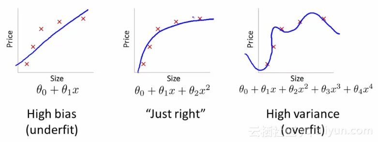
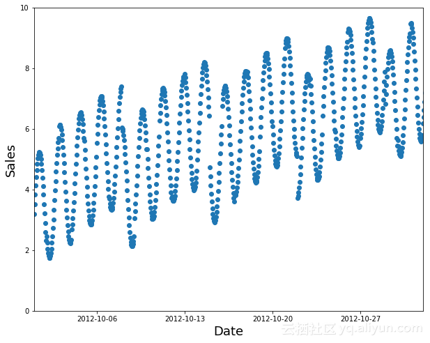
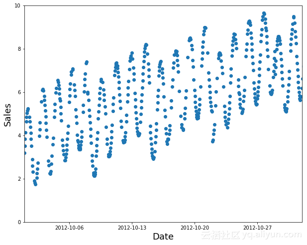
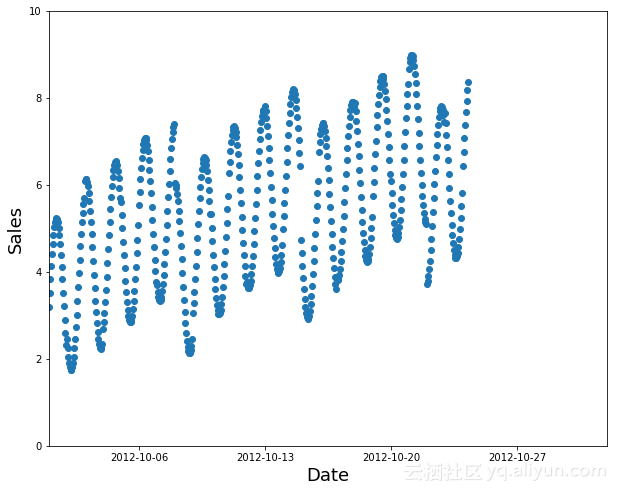
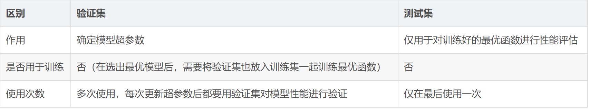
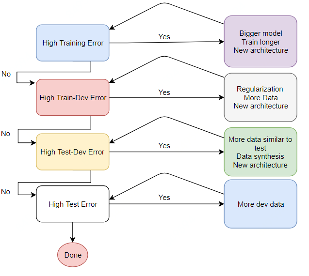

# Task4 模型的训练与验证

## 四、模型训练与验证


### 4.1 学习任务

首先说明一下本任务的学习目标和模型训练与验证

**学习目标**

- 理解验证集的作用，并使用训练集和验证集完成训练
- 学会使用Pytorch环境下的模型读取和加载，并了解调参流程
  
**模型训练与验证**

- 构造验证集
- 模型训练与验证
- 模型保存与加载
- 模型调参流程


### 4.2 构造验证集

#### 4.2.1 什么是验证集？

验证集是用来对学习出来的模型，调整分类器等参数，如在神经网络中选择隐藏单元数。在创建机器学习模型时，最终的目标是要准确掌握新数据，而不仅仅是用于构建数据的数据。考虑下面一组数据的例子：



图中数据点的误差对于最右边的模型是最低的（蓝色曲线几乎完美地通过红色点），但它不是最好的选择。这是为什么？如果你要收集一些新的数据点，他们很可能不会在右边的曲线上，但会更接近中间曲线。

其基本思想是：

- 训练集用于训练给定的模型。
- 验证集用于在模型之间进行选择（例如，随机森林或神经网络是否更适合你的问题？你是否想要一个拥有40棵树或50棵树的随机森林？）。
- 测试集告诉你如何完成。如果你已经尝试了很多不同的模型，你可能会偶然得到一个在你的验证集上做得很好的测试集，并且有一个测试集有助于确保事实并非如此。

#### 4.2.2 什么时候是一个随机子集不够好？

我们通过看几个例子来进行区分，尽管这些例子中有很多来自Kaggle比赛，但它们代表了你在工作场所会遇到的问题。

**1.时间序列**

如果你的数据是一个时间序列，选择一个随机的数据子集将会非常容易（你可以在你试图预测的日期之前和之后查看数据），而不是代表大多数商业用例（你在哪里正在使用历史数据建立未来使用的模型）。如果你的数据包含日期，并且你正在构建要在将来使用的模型，那么你将需要选择一个包含最新日期的连续部分作为验证集（例如，可用数据的最后两个星期或上个月）。

假设你想将下面的时间序列数据拆分为训练集和验证集：



一个随机子集是一个不好的选择：



使用较早的数据作为你的训练集（以及后面的验证集数据）：



Kaggle目前有一个竞赛是预测厄瓜多尔连锁超市的销售。Kaggle的“训练数据”是从2013年1月1日至2017年8月15日，测试数据是2017年8月16日至2017年8月31日。一个好的方法是使用2017年8月1日至8月15日作为你的验证集，所有的早期数据作为你的训练集。

**2.交叉验证**

sklearn没有train_validation_test的原因是假设你经常使用交叉验证，在交叉验证中，是将不同的训练集子集作为验证集。例如，对于3倍交叉验证，将数据分成3组：A，B和C。首先将A和B组合的模型作为训练集进行训练，然后在验证集C上进行评估。将A和C模型训练集作为训练集，并在验证集B上进行评估。将B和C的模型训练集做为训练集，并在验证集A上进行评估。最后对3个模型的性能进行平均。

然而，交叉验证的问题在于，由于上述所有原因，它很少适用于现实世界的问题。交叉验证只适用于你可以随机混洗数据以选择验证集的情况。

#### 4.2.3 训练集、测试集、验证集

- 训练集：用于训练模型，找出最佳的w和b。
- 验证集：用以确定模型超参数，选出最优模型。
- 测试集：仅用于对训练好的最优函数进行性能评估。



### 4.3 模型训练与验证

在本节我们目标使用Pytorch来完成CNN的训练和验证过程，CNN网络结构与之前的章节中保持一致。我们需要完成的逻辑结构如下：

- 构造训练集和验证集；
- 每轮进行训练和验证，并根据最优验证集精度保存模型。

```python
train_loader = torch.utils.data.DataLoader(
    train_dataset,
    batch_size=10, 
    shuffle=True, 
    num_workers=10, 
)
    
val_loader = torch.utils.data.DataLoader(
    val_dataset,
    batch_size=10, 
    shuffle=False, 
    num_workers=10, 
)

model = SVHN_Model1()
criterion = nn.CrossEntropyLoss (size_average=False)
optimizer = torch.optim.Adam(model.parameters(), 0.001)
best_loss = 1000.0
for epoch in range(20):
    print('Epoch: ', epoch)

    train(train_loader, model, criterion, optimizer, epoch)
    val_loss = validate(val_loader, model, criterion)
    
    # 记录下验证集精度
    if val_loss < best_loss:
        best_loss = val_loss
        torch.save(model.state_dict(), './model.pt')
```
其中每个Epoch的训练代码如下：
```python
def train(train_loader, model, criterion, optimizer, epoch):
    # 切换模型为训练模式
    model.train()

    for i, (input, target) in enumerate(train_loader):
        c0, c1, c2, c3, c4, c5 = model(data[0])
        loss = criterion(c0, data[1][:, 0]) + \
                criterion(c1, data[1][:, 1]) + \
                criterion(c2, data[1][:, 2]) + \
                criterion(c3, data[1][:, 3]) + \
                criterion(c4, data[1][:, 4]) + \
                criterion(c5, data[1][:, 5])
        loss /= 6
        optimizer.zero_grad()
        loss.backward()
        optimizer.step()
```
其中每个Epoch的验证代码如下：
```python
def validate(val_loader, model, criterion):
    # 切换模型为预测模型
    model.eval()
    val_loss = []

    # 不记录模型梯度信息
    with torch.no_grad():
        for i, (input, target) in enumerate(val_loader):
            c0, c1, c2, c3, c4, c5 = model(data[0])
            loss = criterion(c0, data[1][:, 0]) + \
                    criterion(c1, data[1][:, 1]) + \
                    criterion(c2, data[1][:, 2]) + \
                    criterion(c3, data[1][:, 3]) + \
                    criterion(c4, data[1][:, 4]) + \
                    criterion(c5, data[1][:, 5])
            loss /= 6
            val_loss.append(loss.item())
    return np.mean(val_loss)
```
### 4.4 模型保存与加载

在Pytorch中模型的保存和加载非常简单，比较常见的做法是保存和加载模型参数：

    torch.save(model_object.state_dict(), 'model.pt')
    model.load_state_dict(torch.load(' model.pt'))

### 4.5 模型调参流程

深度学习原理少但实践性非常强，基本上很多的模型的验证只能通过训练来完成。同时深度学习有众多的网络结构和超参数，因此需要反复尝试。训练深度学习模型需要GPU的硬件支持，也需要较多的训练时间，如何有效的训练深度学习模型逐渐成为了一门学问。

深度学习有众多的训练技巧，比较推荐的阅读链接有：

- http://www.lamda.nju.edu.cn/weixs/project/CNNTricks/CNNTricks.html
- http://karpathy.github.io/2019/04/25/recipe/

根据建议可以以如下逻辑完成：

- 1.初步构建简单的CNN模型，不用特别复杂，跑通训练、验证和预测的流程；

- 2.简单CNN模型的损失会比较大，尝试增加模型复杂度，并观察验证集精度；

- 3.在增加模型复杂度的同时增加数据扩增方法，直至验证集精度不变。



### 4.6 小结

本章讲解了验证集划分方法、模型训练与验证、模型保存和加载以及模型调参流程。需要注意的是模型复杂度是相对的，并不一定模型越复杂越好。在有限设备和有限时间下，需要选择能够快速迭代训练的模型。

## 参考

1. [Kaggle大赛经验：如何（以及为什么）创建一个好的验证集 ](https://www.sohu.com/a/219819248_612370)
2. [机器学习系列（五）——训练集、测试集、验证集与模型选择](https://blog.csdn.net/hohaizx/article/details/81013985?utm_medium=distribute.pc_relevant.none-task-blog-BlogCommendFromMachineLearnPai2-6.nonecase&depth_1-utm_source=distribute.pc_relevant.none-task-blog-BlogCommendFromMachineLearnPai2-6.nonecase)
3. [Datawhale 零基础入门CV赛事-Task4 模型训练与验证](https://github.com/datawhalechina/team-learning/blob/master/03%20%E8%AE%A1%E7%AE%97%E6%9C%BA%E8%A7%86%E8%A7%89/%E8%AE%A1%E7%AE%97%E6%9C%BA%E8%A7%86%E8%A7%89%E5%AE%9E%E8%B7%B5%EF%BC%88%E8%A1%97%E6%99%AF%E5%AD%97%E7%AC%A6%E7%BC%96%E7%A0%81%E8%AF%86%E5%88%AB%EF%BC%89/Datawhale%20%E9%9B%B6%E5%9F%BA%E7%A1%80%E5%85%A5%E9%97%A8CV%20-%20Task%2004%20%E6%A8%A1%E5%9E%8B%E8%AE%AD%E7%BB%83%E4%B8%8E%E9%AA%8C%E8%AF%81%20.md)