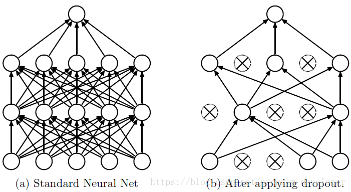
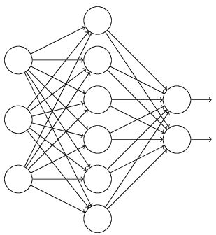
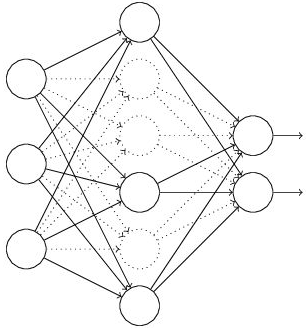
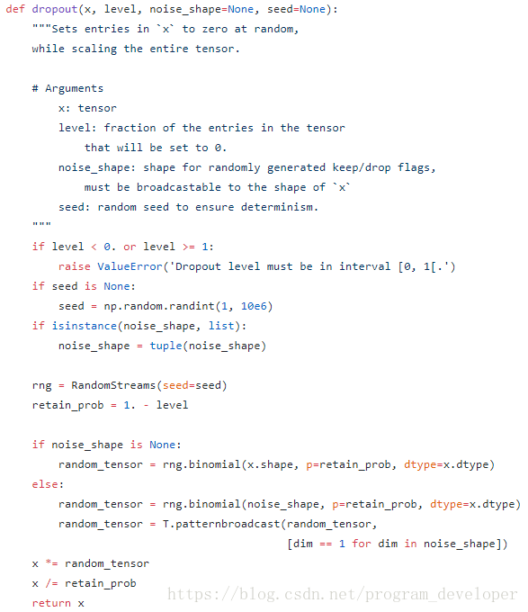

# Task05：模型集成

本章学习如何使用集成学习提高预测精度。

## 五、模型集成

### 5.1 学习目标

**学习目标**

- 学习集成学习方法以及交叉验证情况下的模型集成
- 学会使用深度学习模型的集成学习

**模型集成**

- 集成学习方法介绍
- 深度学习中的集成学习
- Dropout
  - TTA
  - Snapshot
- 结果后处理

### 5.2 集成学习方法介绍

集成学习（Ensemble Learning）有时也被笼统地称作提升（Boosting）方法，广泛用于分类和回归任务。它最初的思想很简单：使用一些（不同的）方法改变原始训练样本的分布，从而构建多个不同的分类器，并将这些分类器线性组合得到一个更强大的分类器，来做最后的决策。

集成学习的理论基础来自于Kearns和Valiant提出的基于PAC（probably approximately correct）的可学习性理论 ，PAC 定义了学习算法的强弱：

弱学习算法：识别错误率小于1/2(即准确率仅比随机猜测略高的算法)
强学习算法：识别准确率很高并能在多项式时间内完成的算法

根据这两个概念，后来产生了一个重要的结论：
**强可学习与弱可学习是等价的，即：一个概念是强可学习的充要条件是这个概念是弱可学习的。**

据此，为了得到一个优秀的强学习模型，我们可以将多个简单的弱学习模型“提升”。

对于集成学习，我们面临两个主要问题：
1.如何改变数据的分布或权重
2.如何将多个弱分类器组合成一个强分类器

针对上述问题，目前主流方法有三种：
1.Boosting方法：包括Adaboosting，提升树（代表是GBDT）, XGBoost等
2.Bagging方法：典型的是随机森林
3.Stacking算法

### 5.3 深度学习中的集成学习

下面介绍一些深度学习中的集成学习思路。

#### 5.3.1 Dropout

**首先先弄清楚什么是dropout**？

在2012年，Hinton在其论文《Improving neural networks by preventing co-adaptation of feature detectors》中提出Dropout。当一个复杂的前馈神经网络被训练在小的数据集时，容易造成过拟合。为了防止过拟合，可以通过阻止特征检测器的共同作用来提高神经网络的性能。

在2012年，Alex、Hinton在其论文《ImageNet Classification with Deep Convolutional Neural Networks》中用到了Dropout算法，用于防止过拟合。并且，这篇论文提到的AlexNet网络模型引爆了神经网络应用热潮，并赢得了2012年图像识别大赛冠军，使得CNN成为图像分类上的核心算法模型。

随后，又有一些关于Dropout的文章《Dropout:A Simple Way to Prevent Neural Networks from Overfitting》、《Improving Neural Networks with Dropout》、《Dropout as data augmentation》。

从上面的论文中，我们能感受到Dropout在深度学习中的重要性。那么，到底什么是Dropout呢？

Dropout可以作为训练深度神经网络的一种trick供选择。在每个训练批次中，通过忽略一半的特征检测器（让一半的隐层节点值为0），可以明显地减少过拟合现象。这种方式可以减少特征检测器（隐层节点）间的相互作用，检测器相互作用是指某些检测器依赖其他检测器才能发挥作用。

Dropout说的简单一点就是：我们在前向传播的时候，让某个神经元的激活值以一定的概率p停止工作，这样可以使模型泛化性更强，因为它不会太依赖某些局部的特征，如图所示。



**Dropout具体流程**

假设我们要训练这样一个神经网络



输入是x输出是y，正常的流程是：我们首先把x通过网络前向传播，然后把误差反向传播以决定如何更新参数让网络进行学习。使用Dropout之后，过程变成如下：

（1）首先随机（临时）删掉网络中一半的隐藏神经元，输入输出神经元保持不变（图3中虚线为部分临时被删除的神经元）



（2） 然后把输入x通过修改后的网络前向传播，然后把得到的损失结果通过修改的网络反向传播。一小批训练样本执行完这个过程后，在没有被删除的神经元上按照随机梯度下降法更新对应的参数（w，b）。

（3）然后继续重复这一过程：

- 恢复被删掉的神经元（此时被删除的神经元保持原样，而没有被删除的神经元已经有所更新）
- 从隐藏层神经元中随机选择一个一半大小的子集临时删除掉（备份被删除神经元的参数）。
- 对一小批训练样本，先前向传播然后反向传播损失并根据随机梯度下降法更新参数（w，b） （没有被删除的那一部分参数得到更新，删除的神经元参数保持被删除前的结果）。

不断重复这一过程。

Dropout实现函数代码如下：



```python
# coding:utf-8
import numpy as np
 
# dropout函数的实现
def dropout(x, level):
    if level < 0. or level >= 1: #level是概率值，必须在0~1之间
        raise ValueError('Dropout level must be in interval [0, 1[.')
    retain_prob = 1. - level
 
    # 我们通过binomial函数，生成与x一样的维数向量。binomial函数就像抛硬币一样，我们可以把每个神经元当做抛硬币一样
    # 硬币 正面的概率为p，n表示每个神经元试验的次数
    # 因为我们每个神经元只需要抛一次就可以了所以n=1，size参数是我们有多少个硬币。
    random_tensor = np.random.binomial(n=1, p=retain_prob, size=x.shape) #即将生成一个0、1分布的向量，0表示这个神经元被屏蔽，不工作了，也就是dropout了
    print(random_tensor)
 
    x *= random_tensor
    print(x)
    x /= retain_prob
 
    return x
 
#对dropout的测试，大家可以跑一下上面的函数，了解一个输入x向量，经过dropout的结果  
x=np.asarray([1,2,3,4,5,6,7,8,9,10],dtype=np.float32)
dropout(x,0.4)
```

#### 5.3.2 TTA

TTA(Test-Time Augmentation) ,即测试时的数据增强

实现步骤如下:

将1个batch的数据通过flips, rotation, scale, etc.等操作生成batches
将各个batch分别输入网络
每个batch的masks/labels反向转换
通过mean, max, gmean, etc.合并各个batch预测的结果
最后输出最终的masks/labels
           Input
             |           # input batch of images 
        / / /|\ \ \      # apply augmentations (flips, rotation, scale, etc.)
       | | | | | | |     # pass augmented batches through model
       | | | | | | |     # reverse transformations for each batch of masks/labels
        \ \ \ / / /      # merge predictions (mean, max, gmean, etc.)
             |           # output batch of masks/labels
           Output

使用方法如下：

```python
import ttach as tta

model.load_state_dict(torch.load('models/%s/model.pth' %args.name))

model.eval()
tta_model = tta.SegmentationTTAWrapper(model, tta.aliases.d4_transform(), merge_mode='mean')

```

### 5.4 本章小结

在本章中讲解了深度学习模型做集成学习的各种方法，并给出了方法的实现代码。

- 集成学习只能在一定程度上提高精度，并需要耗费较大的训练时间，因此建议先使用提高单个模型的精度，再考虑集成学习过程；
- 具体的集成学习方法需要与验证集划分方法结合，Dropout和TTA在所有场景有可以起作用。


## 参考

1. [集成学习方法及思想总结](https://blog.csdn.net/nini_coded/article/details/79341485)
2. [深度学习中Dropout原理解析](https://blog.csdn.net/program_developer/article/details/80737724)
3. [TTA方法](https://github.com/qubvel/ttach)
4. [Datawhale 零基础入门CV赛事-Task5 模型集成](https://github.com/datawhalechina/team-learning/blob/master/03%20%E8%AE%A1%E7%AE%97%E6%9C%BA%E8%A7%86%E8%A7%89/%E8%AE%A1%E7%AE%97%E6%9C%BA%E8%A7%86%E8%A7%89%E5%AE%9E%E8%B7%B5%EF%BC%88%E8%A1%97%E6%99%AF%E5%AD%97%E7%AC%A6%E7%BC%96%E7%A0%81%E8%AF%86%E5%88%AB%EF%BC%89/Datawhale%20%E9%9B%B6%E5%9F%BA%E7%A1%80%E5%85%A5%E9%97%A8CV%20-%20Task%2005%20%E6%A8%A1%E5%9E%8B%E9%9B%86%E6%88%90%20.md)